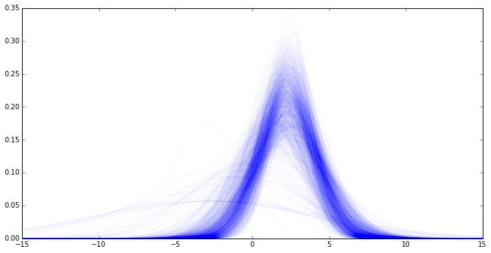

learning-pymc
=============

Just some IPython notebooks that I've been using to learn how to do MCMC with PyMC.

You can either clone/branch/download this code and then view it in IPython, or you can view each notebook online here with nbviewer.
 
* [Baye's Equation example](http://nbviewer.ipython.org/github/drbenvincent/learning-pymc/blob/master/BayesEquation.ipynb)
* [Linear regression example](http://nbviewer.ipython.org/github/drbenvincent/learning-pymc/blob/master/linear_regression.ipynb)
* [1D and 2D indexing](http://nbviewer.ipython.org/github/drbenvincent/learning-pymc/blob/master/indexing.ipynb)

**Not PyMC, but some Python sampler code** (Not my own! Derived from PyMC examples.)

* [Metropolis-Hastings, estimating mean/variance](http://nbviewer.ipython.org/github/drbenvincent/learning-pymc/blob/master/metropolis_hastings.ipynb).

